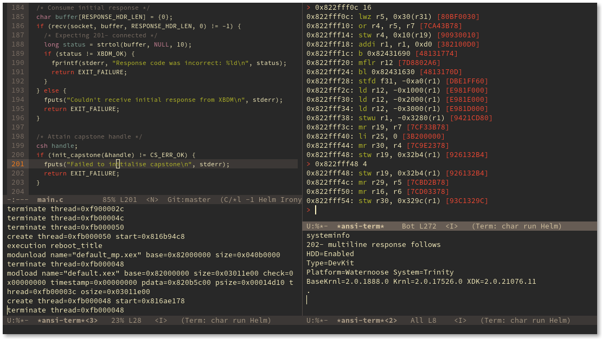

# xbdisasm
Small CLI tool for remotely reading and disassembling memory using the XBDM module found on Xbox 360 development kits and exploited consoles (using nateleroux's version).

To compile: `gcc -O2 main.c -o xbdisasm -lreadline -lcapstone -s`

  
</p
